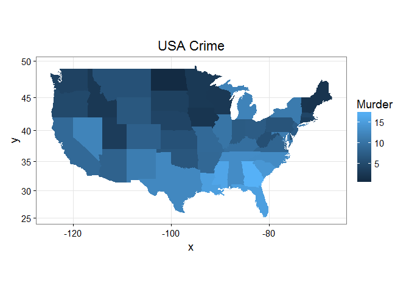

[](https://travis-ci.org/jknowles/eeptools) [](https://coveralls.io/github/jknowles/eeptools?branch=master) [](https://cran.r-project.org/package=eeptools) [](https://github.com/jknowles/eeptools/issues) [](https://github.com/jknowles/eeptools/pulls) [](https://cran.r-project.org/web/packages/eeptools/index.html)

<!-- README.md is generated from README.Rmd. Please edit that file -->
Introduction
============

`eeptools` is an R package that seeks to make it easier for analysts at state and local education agencies to analyze and visualize their data on student, school, and district performance. By putting simple wrappers around a number of R functions, `eeptools` strives to make many common tasks simpler and less prone to error specific to analysis of education data.

Datasets
========

`eeptools` provides three new datasets of interest to education researchers. These datasets are also used in the [R Bootcamp for Education Analysts](www.jaredknowles.com/r-bootcamp)

``` r
library(eeptools)
#> Loading required package: ggplot2
#> Warning: package 'ggplot2' was built under R version 3.2.4
data("stuatt")
head(stuatt)
#>   sid school_year male race_ethnicity birth_date
#> 1   1        2004    1              B      10869
#> 2   1        2005    1              H      10869
#> 3   1        2006    1              H      10869
#> 4   1        2007    1              H      10869
#> 5   2        2006    0              W      11948
#> 6   2        2007    0              B      11948
#>   first_9th_school_year_reported hs_diploma      hs_diploma_type
#> 1                           2004          0                     
#> 2                           2004          0                     
#> 3                           2004          0                     
#> 4                           2004          0                     
#> 5                             NA          1     Standard Diploma
#> 6                             NA          1 College Prep Diploma
#>   hs_diploma_date
#> 1                
#> 2                
#> 3                
#> 4                
#> 5        6/5/2008
#> 6       5/24/2009
```

The `stuatt`, student attributes, dataset is provided from the [Strategic Data Project Toolkit for Effective Data Use](http://sdp.cepr.harvard.edu/toolkit-effective-data-use). This dataset is useful for learning how to clean data in R and how to aggregate and summarize individual unit-record data into group-level data.

``` r
data(stulevel)
head(stulevel)
#>     X school  stuid grade schid dist white black hisp indian asian econ
#> 1  44      1 149995     3   495  105     0     1    0      0     0    0
#> 2  53      1  13495     3   495   45     0     1    0      0     0    1
#> 3 116      1 106495     3   495   45     0     1    0      0     0    1
#> 4 244      1  45205     3   205   15     0     1    0      0     0    1
#> 5 274      1 142705     3   205   75     0     1    0      0     0    1
#> 6 276      1  14995     3   495  105     0     1    0      0     0    1
#>   female ell disab sch_fay dist_fay luck   ability    measerr      teachq
#> 1      0   0     0       0        0    0  87.85405  11.133264 39.09024712
#> 2      0   0     0       0        0    1  97.78756   6.822394  0.09848192
#> 3      0   0     0       0        0    0 104.49303  -7.856159 39.53885270
#> 4      0   0     0       0        0    1 111.67151 -17.574152 24.11612277
#> 5      0   0     0       0        0    0  81.92539  52.983338 56.68061304
#> 6      0   0     0       0        0    0 101.92904  22.604145 71.62196655
#>   year attday schoolscore district schoolhigh schoolavg schoollow   readSS
#> 1 2000    180    29.22427        3          0         1         0 357.2865
#> 2 2000    180    55.96326        3          0         1         0 263.9046
#> 3 2000    160    55.96326        3          0         1         0 369.6722
#> 4 2000    168    55.96326        3          0         1         0 346.5957
#> 5 2000    156    55.96326        3          0         1         0 373.1254
#> 6 2000    157    55.96326        3          0         1         0 436.7607
#>     mathSS     proflvl race
#> 1 387.2803       basic    B
#> 2 302.5724 below basic    B
#> 3 365.4614       basic    B
#> 4 344.4964       basic    B
#> 5 441.1581       basic    B
#> 6 463.4033  proficient    B
```

The `stulevel` dataset is a simulated student-level longitudinal record. It contains student and school level attributes and is useful for practicing evaluating longitudinal analyses of student unit-record data.

``` r
data("midsch")
head(midsch)
#>   district_id school_id subject grade n1   ss1 n2   ss2 predicted
#> 1          14       130    math     4 44 433.1 40 463.0  468.7446
#> 2          70        20    math     4 18 443.0 20 477.2  476.4765
#> 3         112        80    math     4 86 445.4 94 472.6  478.3509
#> 4         119        50    math     4 95 427.1 94 460.7  464.0586
#> 5         147        60    math     4 27 424.2 27 458.7  461.7937
#> 6         147       125    math     4 17 423.5 26 463.1  461.2470
#>    residuals     resid_z     resid_t       cooks test_year     tprob
#> 1 -5.7445937 -0.59189645 -0.59170988 0.000171271      2007 0.2787298
#> 2  0.7235053  0.07455731  0.07452135 0.000003510      2007 0.4706873
#> 3 -5.7508949 -0.59266905 -0.59248250 0.000244921      2007 0.2774827
#> 4 -3.3585931 -0.34605798 -0.34591020 0.000059900      2007 0.3650957
#> 5 -3.0936928 -0.31877383 -0.31863490 0.000054100      2007 0.3762745
#> 6  1.8530072  0.19093568  0.19084643 0.000019800      2007 0.4250936
#>   flagged_t95
#> 1           0
#> 2           0
#> 3           0
#> 4           0
#> 5           0
#> 6           0
```

The `midsch` dataset contains an analysis on abnormality in school average assessment scores. It contains observed and predicted values of aggregated test scores at the school level for a large midwestern state.

Administrative Data Functions
=============================

For analysts using unit-record data of some type, there are several `calc` functions which automate common tasks including calculating ages (`age_calc`), grade retention (`retained_calc`), and student mobility (`moves_calc`).

``` r
age_calc(dob = as.Date('1995-01-15'), enddate = as.Date('2003-02-16'), 
         units = "years")
#> [1] 8.087671
age_calc(dob = as.Date('1995-01-15'), enddate = as.Date('2003-02-16'), 
         units = "months")
#> [1] 97.03571
age_calc(dob = as.Date('1995-01-15'), enddate = as.Date('2003-02-16'), 
         units = "days")
#> Time difference of 2954 days
```

`age_calc` also now properly accounts for leap years and leap seconds by default.

`retained_calc` takes a vector of student identifiers and a vector of grades and checks whether or not the student was retained in the grade level specified by the user. It returns a data.frame of all students who could have been retained and a yes or no indicator of whether they were retained.

``` r
x <- data.frame(sid = c(101, 101, 102, 103, 103, 103, 104, 105, 105, 106, 106),
                 grade = c(9, 10, 9, 9, 9, 10, 10, 8, 9, 7, 7))
retained_calc(df = x, sid = "sid", grade = "grade", grade_val = 9)
#>   sid retained
#> 1 101        N
#> 2 102        N
#> 3 103        Y
#> 4 105        N
```

`retained_calc` is intended to be used after you have processed your data as it does not take into account time or sequence other than the order in which the data is passed to it.

`moves_calc` is intended to identify based on enrollment dates whether a student experienced a school move within a school year.

``` r
df <- data.frame(sid = c(rep(1,3), rep(2,4), 3, rep(4,2)),
                   schid = c(1, 2, 2, 2, 3, 1, 1, 1, 3, 1),
                   enroll_date = as.Date(c('2004-08-26',
                   '2004-10-01', '2005-05-01', '2004-09-01',
                   '2004-11-03', '2005-01-11', '2005-04-02',
                   '2004-09-26', '2004-09-01','2005-02-02'), format='%Y-%m-%d'),
                   exit_date = as.Date(c('2004-08-26', '2005-04-10',
                    '2005-06-15', '2004-11-02', '2005-01-10',
                    '2005-03-01', '2005-06-15', '2005-05-30',
                    NA, '2005-06-15'), format='%Y-%m-%d'))

moves <- moves_calc(df, sid = "sid", schid = "schid", enroll_date = "enroll_date", 
                    exit_date = "exit_date")
moves
#>   sid moves
#> 1   1     4
#> 2   2     4
#> 3   3     2
#> 4   4    NA
```

Manipulate Data
===============

Another set of key functions in the package are to make basic data manipulation easier. One thing users of other statistical packaegs may miss when using R is a convenient function for determining the `mode` of a vector. The `statamode` function is designed to do just that. `statamode` works with numeric, character, and factor data types. It also includes various options for how to deal with a tie demonstrated below.

``` r
vecA <- c(1, 2, 3, 4, 5, 6, 7, 8, 9, 10)
statamode(vecA, method = "stata")
#> [1] "."
vecB <- c(1, 1, 1, 3:10)
statamode(vecB, method = "last")
#> [1] 1
vecC <- c(1, 1, 1, NA, NA, 5:10)
statamode(vecC, method = "last")
#> [1] 1
vecA <- c(LETTERS[1:10]); vecA <- factor(vecA)
statamode(vecA, method = "last")
#> [1] J
#> Levels: J
vecB <- c("A", "A", "A", LETTERS[3:10]); vecB <- factor(vecB)
statamode(vecB, method = "last")
#> [1] A
#> Levels: A
vecA <- c(LETTERS[1:10])
statamode(vecA, method = "sample")
#> [1] "D"
vecB <- c("A", "A", "A", LETTERS[3:10])
statamode(vecB, method = "stata")
#> [1] "A"
vecC <- c("A", "A", "A", NA, NA, LETTERS[5:10])
statamode(vecC, method = "stata")
#> [1] "A"
```

There are a number of functions to save you keystrokes like `defac` for converting a factor to a character, `makenum` for turning a factor variable into a numeric variable, `max_mis` for taking the maximum of a vector of numerics and ignoring any NAs (useful for inclusion in `do.call` or `apply` constructions). `remove_char` allows you to quickly `gsub` out a specific character from a string vector such as an `*` or `...`. `decomma` is a somewhat specialized version of this for processing data where numerics are written with commas. `nth_max` allows you to identify the 2nd, 3rd, etc. maximum value in a vector.

Regression Models
=================

`eeptools` includes ways to simplify the use of regression analyses tools recommended by Gelman and Hill 2006 through the `gelmansim` function, which itself is a wrapper for the `arm::sim()` function.

``` r
require(MASS)
#> Loading required package: MASS
#> Warning: package 'MASS' was built under R version 3.2.4
#Examples of "sim" 
set.seed (1)
J <- 15
n <- J*(J+1)/2
group <- rep (1:J, 1:J)
mu.a <- 5
sigma.a <- 2
a <- rnorm (J, mu.a, sigma.a)
b <- -3
x <- rnorm (n, 2, 1)
sigma.y <- 6
y <- rnorm (n, a[group] + b*x, sigma.y)
u <- runif (J, 0, 3)
dat <- cbind (y, x, group)
# Linear regression 
dat <- as.data.frame(dat)
dat$group <- factor(dat$group)
M3 <- glm (y ~ x + group, data=dat)
cases <- expand.grid(x = seq(-2, 2, by=0.1), 
                     group=seq(1, 14, by=2))
cases$group <- factor(cases$group)
sim.results <- gelmansim(mod = M3, newdata = cases, n.sims=200, na.omit=TRUE)
head(sim.results)
#>      x group       yhats   yhatMin  yhatMax
#> 1 -2.0     1  1.49216152 -5.317070 8.826878
#> 2 -1.9     1  1.05530376 -6.141328 9.084779
#> 3 -1.8     1  1.50069226 -5.341525 8.256558
#> 4 -1.7     1 -0.04991641 -7.027672 6.982415
#> 5 -1.6     1  0.50262366 -6.315685 7.944253
#> 6 -1.5     1 -0.32213552 -7.343319 6.737021
```

Plotting Themes
===============

The package includes a number of themes for `ggplot2` named `theme_dpi` to reflect their internal use at the Wisconsin Department of Public Instruction. These themes are very similar to the `theme_bw()` within `ggplot2` but with font sizes optimized for presentations and publications.

``` r
crimes <- data.frame(state = tolower(rownames(USArrests)), USArrests)
require(reshape) # for melt
#> Loading required package: reshape
#> Warning: package 'reshape' was built under R version 3.2.5
crimesm <- melt(crimes, id = 1)
states_map <- map_data("state")
#> Warning: package 'maps' was built under R version 3.2.5
p1 <- ggplot(crimes, aes(map_id = state)) + geom_map(aes(fill = Murder), 
                                                     linetype = 1, map = states_map) + 
       expand_limits(x = states_map$long, y = states_map$lat) + labs(title="USA Crime")
p1 <- p1 + coord_map()
p1 + theme_dpi_map()
#> Warning: 'theme_dpi_map' is deprecated.
#> Use 'theme_bw' instead.
#> See help("Deprecated")
```



There is also a `ggplot2` version of `plot.lm` included:

``` r
data(mpg)
mymod <- lm(cty~displ + cyl + drv, data=mpg)
autoplot(mymod)
```


Finally, there is a convenient method for creating labeled mosaic plots.

``` r
sampDat <- data.frame(cbind(x=seq(1,3,by=1), y=sample(LETTERS[6:8], 60, 
                                                        replace=TRUE)),
                        fac=sample(LETTERS[1:4], 60, replace=TRUE))
varnames<-c('Quality','Grade')
crosstabplot(sampDat, "y", "fac", varnames = varnames,  label = TRUE, 
             title = "Crosstab Plot", shade = FALSE)
```


Helping Out
===========

`eeptools` is intended to be a useful project for the education analytics community. Contributions are welcomed. Please note that this project is released with a [Contributor Code of Conduct](CONDUCT.md). By participating in this project you agree to abide by its terms.
